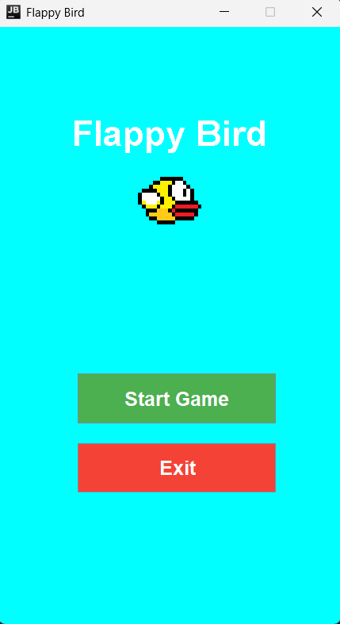
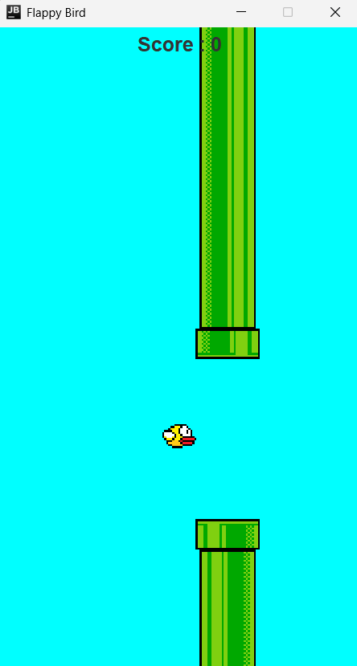
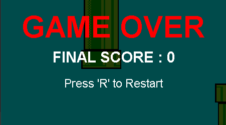

# TP6DPBO2425C1

## Janji

Saya Daffa Dhiyaa Candra dengan NIM 2404286 mengerjakan  
TP 6 dalam mata kuliah Desain dan Pemrograman  
Berorientasi Objek untuk keberkahanNya maka saya tidak  
melakukan kecurangan seperti yang telah dispesifikasikan. Aamiin.  

## Desain Program

Ini adalah clone sederhana dari game populer **Flappy Bird**, dibuat menggunakan **Java Swing GUI**.  

### Struktur Kelas
#### `App`
- Mengatur tampilan awal dan jendela utama.
- Menampilkan **menu utama** dengan tombol **Start** dan **Exit**.
- Setelah tombol **Start** diklik, menu akan ditutup dan game akan dimulai.

### `MainMenu`
- Menampilkan **halaman utama** saat program dijalankan pertama kali.
- Memiliki dua tombol:
  - **Play Game** → memanggil `App.startGame()` untuk memulai permainan.
  - **Exit** → menutup program.
- Menggunakan `JFrame` dengan layout yang sederhana dan responsif.

#### `Logic`
- Mengatur seluruh **gameplay**:
  - Pergerakan **player (burung)** dan **pipa**.
  - Deteksi **Game Over** ketika burung menabrak pipa atau jatuh ke bawah.
  - Menghitung **skor** pemain.
- Mengimplementasikan **ActionListener** untuk loop permainan.
- Mengatur **restart game** dengan menekan tombol `R`.

### `View`
- Bertanggung jawab untuk **menampilkan grafis game**.
- Menggambar semua elemen visual seperti:
  - **Player** (burung)
  - **Pipe** (rintangan)
  - **Latar belakang**
  - **Skor** dan **teks Game Over**
- Mengatur **penempatan tulisan dan efek transparansi** pada tampilan Game Over.
- Menampilkan teks:
  - `"GAME OVER"`
  - `"FINAL SCORE"`
  - `"Press R to Restart"`

#### `Pipe`
- Mewakili **rintangan** yang harus dilewati player.
- Menyimpan atribut seperti posisi, ukuran, gambar, dan kecepatan.
- Memiliki **getter** dan **setter** untuk setiap atribut.

#### `Player`
- Mewakili **karakter burung** yang dikendalikan pemain.
- Menyimpan atribut posisi, kecepatan, ukuran, dan gambar.
- Memiliki **getter** dan **setter**.

---

## Penjelasan Alur

### 1️. Menu Awal
- Program membuat **JFrame menu utama**.
- Tombol **Start** akan memanggil `App.startGame()` dan menutup jendela menu.
- Game dimulai di jendela baru.

### 2️. Inisialisasi Panel Game
- Program mengatur ukuran, background, serta elemen visual seperti **player**, **pipa**, dan **label skor**.
- Dua **timer** dijalankan:
  - `gameLoop` → memperbarui game setiap frame (60 FPS).
  - `pipesCoolDown` → menambahkan pipa baru setiap beberapa detik.

### 3️. Logika Game
- Player bergerak dengan efek gravitasi.
- Pipa bergerak ke kiri secara konstan.
- Deteksi **kalah** jika:
  - Player menyentuh pipa (overlap posisi X dan Y).
  - Player jatuh melewati batas bawah window.
- Skor bertambah setiap kali player berhasil melewati satu pasang pipa.
- Jika game over, teks "GAME OVER", skor akhir, dan "Press R to Restart" akan muncul.

### 4. Restart Game
- Saat **game over**, pemain dapat menekan `R` untuk memanggil `restartGame()` dan mengulang dari awal.

---

## Kontrol

**Spasi**, Membuat burung terbang ke atas  
**R**, Restart game setelah Game Over  

## Dokumentasi

### Menu  
  

### Gameplay
  

### GameOver  
  